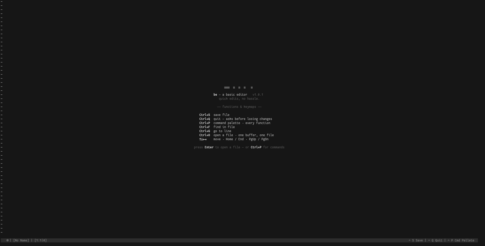
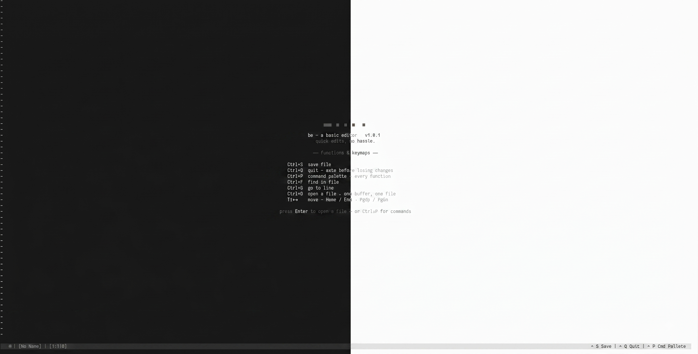

<picture>
  <source media="(prefers-color-scheme: dark)" srcset="assets/dark-be.png">
  <source media="(prefers-color-scheme: light)" srcset="assets/light-be.png">
  
</picture>

# be — a basic editor

A small, dependency-free terminal text editor written in C. Quick edits, no hassle.

> **Author:** Satwik Srivastava<br/>
> **Version:** 1.0.2<br/>
> **License:** MIT<br/>

---

## Goals and Non-Goals

### What this is
1. A no-external-dependency editor that opens fast and gets out of your way for quick, dirty edits — the kind of thing you reach for instead of `nano` or a full `vim`/`neovim` setup.
2. Readline-style navigation and editing everywhere text is typed — in the file buffer, and in every dialog box and the command palette.
3. Configurable the suckless way — a single `config.h` you edit and recompile.

### What this isn't and will never be
1. A Vim/Emacs replacement — there are no modes, no keybinding remaps, no plugin system.
2. A full featured ide or tui-ide which has modern features multi-threaded multi-cursor support or any other fancy features.

> Some features are still in planning state. See [planned](#planned) to see them

## Showcase

<picture>
  <source media="(prefers-color-scheme: light)" srcset="assets/combined-be.png">
  
</picture>

*Left half dark theme, right half light theme — same splash screen, `config.h` decides which one you get.*

## Features

- Full text editing: insert, delete, multi-line files, save/save-as
- Readline-style navigation and editing — word-left/right, home/end, ctrl+backspace/delete, alt-backspace — available in the file buffer **and** in every dialog box and the command palette
- Command palette (`Ctrl+P`) to browse and run every command the editor offers
- Open dialog (`Ctrl+O`) with a non-interactive preview of the first few entries in the target directory
- Goto-line dialog (`Ctrl+G`)
- Find-in-file (`Ctrl+F`) with match highlighting
- Save dialog that pops up on `Ctrl+Shift+S` (save as) or automatically when quitting/saving an unnamed buffer
- Confirmation prompt before quitting with unsaved changes
- Mouse support: click to move the cursor, scroll to navigate (toggle in `config.h`)
- `+ROW` / `+ROW:COL` CLI flags to open a file at a specific position
- Light and dark themes, fully defined in `config.h`
- Tiny footprint: \~2MB resident for a 3200+ line file (`vi` \~14MB, `nvim` \~15MB, `nano` \~6.3MB on the same file)
- Single C file, no external dependencies beyond the C standard library and POSIX termios

## Keybindings

| Key | Action |
|---|---|
| `Ctrl+S` | Save file |
| `Ctrl+Shift+S` | Save file as |
| `Ctrl+O` | Open file |
| `Ctrl+Q` | Quit (asks before losing changes) |
| `Ctrl+P` | Command palette |
| `Ctrl+F` | Find in file |
| `Ctrl+G` | Go to line |
| `Ctrl+Home` or `Ctrl+A` / `Ctrl+End` or `Ctrl+E` | Go to start / end of file |
| `Alt+A` / `Alt+E` | Start / end of line |
| `↑ ↓ ← →` | Move cursor |
| `Ctrl+←` / `Ctrl+→` | Move by word |
| `Home` / `End` | Start / end of line |
| `PgUp` / `PgDn` | Page up / down |
| `Backspace` / `Delete` | Delete character |
| `Ctrl+Backspace`, `Ctrl+W`, `Alt+Backspace` | Delete word backward |
| `Ctrl+Delete` | Delete word forward |
| Mouse click | Move cursor to clicked position |
| Mouse scroll | Scroll the buffer |

The full, authoritative command list (with hints) is always available at `Ctrl+P`.

## Build

**With Make (recommended):**
```bash
make
```
Output binary: `build/be`

**Manually with GCC:**
```bash
gcc -o be be.c -Wall -Wextra -O2
```

**Compiler flags used by Makefile:** `-Wall -Wextra -O2`

## Install

```bash
make install
```

Installs to `$HOME/.local/bin/be` by default. Override with `PREFIX`:

```bash
make install PREFIX=/usr/local
```

## Usage

```bash
be                     # open the splash screen / blank buffer
be file.txt            # open a file
be file.txt +42        # open a file, jump to line 42
be file.txt +42:8      # open a file, jump to line 42, column 8
be -v | --version       # print version info
be -h | --help          # print usage
```

**Clean build artifacts:**
```bash
make clean
```

## Configuration

All editor configuration lives in [`config.h`](config.h) (suckless-style — edit the header, recompile):

- `LIGHT_THEME_MODE` / `DARK_THEME_MODE` — pick a theme
- Status bar, splash screen, dialog box and command palette colors
- `ENABLE_MOUSE_SUPPORT` — turn mouse handling on/off
- `MOUSE_SCROLL_DELTA` — how many lines the mouse wheel scrolls per tick

## Platform Notes

`be` relies on POSIX `termios` raw-mode terminal control, ANSI/CSI escape sequences, and the SGR mouse-reporting protocol. It compiles and runs on Linux, macOS, and WSL. Native Windows (MSVC/MinGW without POSIX headers) is not supported without modification.

## Planned

See [`todo.md`](todo.md) for the full running list. Highlights:

- Syntax highlighting via a runtime-loaded keyword file
- Find and replace
- Clipboard keymaps (`Ctrl+C` / `Ctrl+V` / `Ctrl+X`)
- Automatic bracket/quote pairing
- A minimal file-explorer view embedded in the open dialog
- Selection of text using CTRL+SHIFT+ArrowKeys
- Mouse drag selection, move-line-up/down

## License

MIT License — see [LICENSE](LICENSE) for details.
